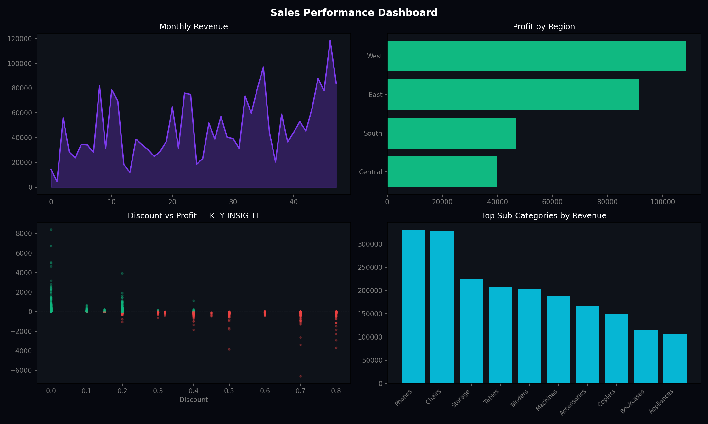

# 📊 Executive Sales Performance Dashboard



---

## 📌 Project Overview

This project analyzes **4 years of Superstore transactional data** to surface executive-level insights on revenue growth, regional profitability, discount strategy, and product performance — using **Python, SQLite, and Matplotlib**.

The core question this dashboard answers:
> *Is the business growing profitably, or is revenue growth masking margin erosion?*

---

## 🔍 Key Business Insights

| # | Insight | Finding |
|---|---|---|
| 1 | **Revenue is growing** | Monthly sales trend shows consistent upward trajectory with seasonal peaks |
| 2 | **West & East dominate profit** | West and East regions far outperform South and Central in total profit |
| 3 | **Discounts destroy margins** | Orders with >40% discount cluster below the $0 profit line — heavy discounting is a loss-maker |
| 4 | **Phones & Chairs lead revenue** | Top 2 sub-categories alone account for a disproportionate share of total sales |

---

## 📁 Project Structure

```
Executive Sales Performance Dashboard/
│
├── Data/
│   ├── Sample - Superstore.csv           # Raw transactional data (source)
│   └── store.db                          # SQLite database (auto-generated)
│
├── Images/
│   └── sales_dashboard.png               # Exported dashboard visualization
│
├── Notebook/
│   ├── Sales_Performance_Data.ipynb      # Data loading & cleaning
│   ├── EDA-Sales_Performance.ipynb       # SQL queries & exploratory analysis
│   ├── Sales_Dashboard.ipynb             # Matplotlib dashboard charts
│   └── Sales_Performance.ipynb          # Full end-to-end combined notebook
│
└── README.md
```

---

## 🗂️ Notebook Breakdown

| Notebook | Stage | What it does |
|---|---|---|
| `Sales_Performance_Data.ipynb` | Data Loading & Cleaning | Reads CSV, parses dates, loads into SQLite |
| `EDA-Sales_Performance.ipynb` | Exploratory Data Analysis | SQL queries for YoY, Pareto, Discount analysis |
| `Sales_Dashboard.ipynb` | Visualization | Builds the 4-chart matplotlib dashboard |
| `Sales_Performance.ipynb` | End-to-End | Full pipeline combined in one notebook |

---

## 🛠️ Tech Stack

| Tool | Purpose |
|---|---|
| `pandas` | Data loading, cleaning, datetime parsing |
| `sqlite3` | SQL engine for aggregation queries |
| `matplotlib` | Dashboard visualization |
| `numpy` | Numerical support |
| **SQL Window Functions** | Pareto cumulative % calculation |

---

## 📊 Dashboard Breakdown

### 1. Monthly Revenue Trend
Tracks total sales aggregated by month across the full dataset period. The area fill highlights volume, while the line exposes seasonality — clear revenue spikes appear toward year-end (Q4 holiday effect).

### 2. Profit by Region
Horizontal bar chart comparing total profit across the 4 regions. All regions are profitable, but **West and East significantly outperform** South and Central — signalling potential operational or pricing inefficiencies in those regions.

### 3. Discount vs Profit — Key Insight ⚠️
Each dot represents one order, colored green (profitable) or red (loss-making). The pattern is unambiguous:
- Orders with **0–20% discount** are mostly profitable
- Orders with **>40% discount** fall almost entirely below the zero-profit line
- The business is subsidizing customers through excessive discounting

### 4. Top Sub-Categories by Revenue
Bar chart of the top 10 sub-categories. **Phones and Chairs** are the clear revenue leaders, driving inventory, marketing, and procurement prioritization decisions.

---

## 🧠 SQL Techniques Used

**YoY Aggregation with non-standard date format:**
```sql
-- Date stored as M/D/YYYY — strftime won't work, so we extract year by length
substr("Order Date", length("Order Date")-3) AS yr
```

**Pareto Cumulative % with Window Functions:**
```sql
sum(sum(profit)) OVER (ORDER BY sum(profit) DESC
    ROWS BETWEEN UNBOUNDED PRECEDING AND CURRENT ROW)
    * 100.0 / sum(sum(profit)) OVER ()
```

**CASE band ordering (strictest condition first):**
```sql
CASE
    WHEN discount = 0    THEN 'No Discount'
    WHEN discount < 0.2  THEN 'Low 0-20%'
    WHEN discount <= 0.4 THEN 'Medium 20-40%'
    ELSE                      'High >40%'
END
```

---

## ▶️ How to Run

1. **Clone the repo**
```bash
git clone https://github.com/your-username/executive-sales-dashboard.git
cd "Executive Sales Performance Dashboard"
```

2. **Install dependencies**
```bash
pip install pandas matplotlib numpy
```

3. **Run notebooks in order**
```
1. Sales_Performance_Data.ipynb   ← load & clean
2. EDA-Sales_Performance.ipynb    ← SQL analysis
3. Sales_Dashboard.ipynb          ← visualize
```
> Or run `Sales_Performance.ipynb` for the full end-to-end pipeline in one go.

---

## 💸 Headline Finding

```
Profit lost from >40% discounts: $-106.71
```

Discounting above 40% is not a growth strategy — it is a profit destruction strategy. The data makes this case quantitatively and visually.

---

## 👩‍💻 Author

**Indrani Abbireddy**  
Data Analyst Portfolio Project  
[GitHub](https://github.com/aindrani290101) · [LinkedIn](https://www.linkedin.com/in/indrani-nageswara-rao29/)
